<h1>Hi there, I'm Bhavya S Solanki ♟️👋</h1>
<h3>a.k.a. <a href="https://github.com/BSS2707">@BSS2707</a> on GitHub</h3>

 

## 👨‍💻 About Me

AI/ML Student & Developer • Data Scientist • Web Designer • Python Developer • Educator • Chess & Cricket Enthusiast ♟️🏏

- 🌐 Portfolio: **[bhavyasolanki.netlify.app](https://bhavyasolanki.netlify.app/)**
- ✍️ Blog: **[bhavyasolanki.netlify.app/blog](https://bhavyasolanki.netlify.app/blog)**
 

## 📌 Pinned Projects

> 🧠 **[IndLan](https://github.com/BSS2707/IndLan)** — my own custom programming language, built from scratch with `.ind` file extension.

<ul>
<li>📊 <b><a href="https://github.com/BSS2707/E-commerce-Churn-Data-Analysis-via-Streamlit-Matplotlib">E-commerce-Churn-Data-Analysis-via-Streamlit-Matplotlib</a></b> — customer churn analysis dashboard (Python)</li>
<li>🧩 <b><a href="https://github.com/BSS2707/leetcode_code_slove">leetcode_code_slove</a></b> — LeetCode problem solutions (Python)</li>
<li>📈 <b><a href="https://github.com/BSS2707/Stock-Price-Prediction-Dashboard">Stock-Price-Prediction-Dashboard</a></b> — stock price prediction dashboard (Python)</li>
</ul>

 

## 🛠️ Tech Stack

<!-- Replace/remove badges to match your actual stack -->

 

## 📊 GitHub Stats

 

## 🌐 Connect With Me

<!-- Add your email here if you want it public -->
<!--  -->

 

  

